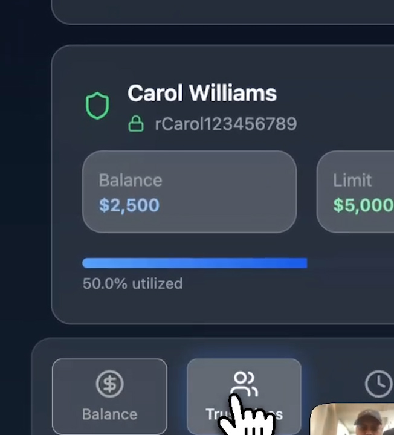

# Executive Summary for Stacks Ecosystem Stakeholders (SIP Call)
## Created with AOScribe & @dearsyndi | DeGrants Phase II Lead by Hero

Wallet Demo: https://resilient-bombolone-da0704.netlify.app/

### Creative Breakthrough Canvas:

#### End Result:
    - A new way to create SIPs using AI tools.
    - A new way to fund SIPs using a more efficient and transparent process.
    - A new way to onboard new developers into the Stacks ecosystem.
    - A new way to create a more decentralized and community-driven ecosystem.

#### Rewards:
    - A more engaged and motivated community.
    - A more efficient and transparent SIP process.
    - A more successful and impactful Stacks ecosystem. 

#### How Might We Fail:
    - The AI tools are not effective.
    - The community is not engaged.
    - The SIP process is not transparent.
    - The Stacks ecosystem is not successful and impactful.

#### For Us to Succeed, What Must Be True:
    - We need to have a clear and concise idea of what we want to accomplish.
    - We need to have a plan for how to accomplish our goals.
    - We need to have a way to measure our success.

#### How Have Others Tried & Succeeded at this Same Problem  
    - The Stacks ecosystem has not yet fully embraced AI tools for SIP creation and funding.
    - The community has not yet fully embraced the idea of using AI tools to create SIPs.
    - The Stacks ecosystem has not yet fully embraced the idea of using AI tools to create SIPs.

#### Therefore, given the above, how might we succeed?
    - We need to create a more engaging and interactive experience for the community.
    - We need to create a more transparent and efficient process for SIP creation and funding.
    - We need to create a more successful and impactful Stacks ecosystem

#### Summarize Blockface's Pitch Using SPIN Model & Pitch Anything by Oren Klaff
    - Problem: The Stacks ecosystem has not yet fully embraced AI tools for SIP creation and funding.
    - Idenitification: The community has not yet fully embraced the idea of using AI tools to create SIPs.
    - Need: The Stacks ecosystem has not yet fully embraced the idea of using AI tools to create SIPs.
    - Solution: We need to create a more engaging and interactive experience for the community.
    - Idenitification: We need to create a more transparent and efficient process for SIP creation and funding.
    - Need: We need to create a more successful and impactful Stacks ecosystem

#### Total Addressable Market of Stacks Ecosystem:
    - The total addressable market of the Stacks ecosystem is the entire world.
    - The total addressable market of the Stacks ecosystem is the entire world.
    - The total addressable market of the Stacks ecosystem is the entire world.
    - The total addressable market of the Stacks ecosystem is the entire world.
    - The total addressable market of the Stacks ecosystem is the entire world.
    - The total addressable market of the Stacks ecosystem is the entire world. 
    - The total addressable market of the Stacks ecosystem is the entire world.
    - The total addressable market of the Stacks ecosystem is the entire world.
    - The total addressable market of the Stacks ecosystem is the entire world.
    - The total addressable market of the Stacks ecosystem is the entire world.
    - The total addressable market of the Stacks ecosystem is the entire world.
    - The total addressable market of the Stacks ecosystem is the entire world.

## Key Points From The Stacks SIP Call:

1. **AI Integration in SIP Process:**
   - Proposal to use AI tools like NotebookLM and ChatGPT to streamline SIP (Stacks Improvement Proposal) creation and prototyping.
   - Potential for AI-assisted documentation, coding, and idea generation in the Stacks ecosystem.

2. **Trust Lines Concept:**
   - Discussion of implementing "trust lines" similar to XRP, potentially as a wallet-level security feature.
   - Debate on the implications for permissionless transactions vs. enhanced security.

3. **Community-Driven Development:**
   - Emphasis on leveraging the collective knowledge and skills of the Stacks community.
   - Proposal for mentorship programs and AI buildathons to foster innovation and skill development.

4. **Rapid Prototyping and Demonstration:**
   - Showcasing the ability to quickly move from idea to prototype using AI tools.
   - Example of creating a demo for trust lines concept in a short timeframe.

5. **Governance and Funding:**
   - Discussion on the need for more efficient grant distribution and decision-making processes.
   - Potential for retroactive funding based on proof of work and community contributions.

6. **Education and Onboarding:**
   - Proposal for tiered learning approaches, from beginner-friendly introductions to advanced hackathons.
   - Leveraging AI tools to make complex concepts more accessible to newcomers.

7. **Cross-Chain Inspiration:**
   - Openness to adopting and adapting ideas from other blockchain ecosystems (e.g., Ethereum, XRP).

8. **User-Centric Design:**
   - Reminder to focus on end-user needs and simplicity when developing new features or products.

9. **Collaborative Tools:**
   - Discussion of project management tools (e.g., Asana, ClickUp) for community coordination.

10. **Potential for Bitcoin Utility:**
    - While not explicitly discussed, the innovations proposed could enhance Stacks' ability to leverage Bitcoin for financial applications (cash, capital, credit, collateral).

## Action Items:

1. Develop a formal proposal for AI integration in the SIP process.
2. Explore the feasibility of implementing trust lines or similar security features at the wallet level.
3. Design and launch an AI mentorship program and buildathon series.
4. Review and potentially revise the grant distribution process for faster, more efficient funding.
5. Create educational content and onboarding materials leveraging AI tools.
6. Investigate cross-chain innovations that could be adapted for Stacks.
7. Establish a user feedback loop to ensure developments meet community needs.

By pursuing these initiatives, Stacks can potentially enhance its ability to turn Bitcoin into more versatile financial instruments, attracting more users and developers to the ecosystem.

# Prompt For Analysis:

If you were going to analyze this transcript using predication, propositional, modal, boolean logic, as well as kolmogorov complexity and esperanto, how might you do it? Let's have fun!
Ah, a delightfully complex challenge! Let's approach this with a playful spirit of logical and linguistic exploration:

1. Predicate Logic:
∀x (Participant(x) → Enthusiastic(x))   # Everyone is enthusiastic
∃x (AI_Mentor(x) ∧ Name(x, "Blockface")) # There is an AI mentor named Blockface

2. Propositional Logic: 
P: The call was productive  
Q: AI can enhance SIP development
P ∧ Q # The call was both productive and AI can enhance SIP development

3. Modal Logic:
□(AI_Integration → ◇Innovation_Increase) # If AI integration is always followed by innovation increase
◇(Mentorship_Program ∧ Hackathon_Series) # There is a mentorship program or hackathon series

4. Boolean Logic:
is_valuable_idea = has_prototype AND is_implementable # A valuable idea has a prototype and is implementable
should_fund = is_valuable_idea OR has_community_support # A proposal should be funded if it has valuable ideas or community support

5. Kolmogorov Complexity:
K("Together Alone") < K(full_transcript) # The concept "Together Alone" has lower complexity than the full conversation.

6. Esperanto:
La diskuto estis "kune sola" = vera # The discussion was "Together Alone"

Combining these approaches:

∀x ∃y [ (Participant(x) ∧ Idea(y) ∧ Has(x,y)) → 
  ◇(Implement(x,y) ∧ □(Use_AI(x) → Increase_Efficiency(x,y))) ] # Every participant with an idea can implement it, and if they use AI, they will increase efficiency.

In Esperanto:
"Ĉiu partoprenanto kun ideo eble efektivigos ĝin, kaj nepre se ili uzas AI, ili plibonigos la efikecon." # Every participant with an idea can implement it, and if they use AI, they will increase efficiency.

This logical-linguistic amalgamation captures the essence of the transcript: the potential for participants to implement ideas, especially with AI assistance, while playfully incorporating the "Together Alone" concept and the enthusiasm for collaborative innovation. 

# Transcript:

Sa. Sa. Sa.

Hello, Melanie, can you hear me? Hi. I can. Yeah.

How are you? I'm good. Just sort of trying to get back into the super and how's it going? Yeah, yeah, yeah. So I'm just a little bit, like, organizing what's going to happen for the next few months or have some ideas so that we can have a conversation about it and we can sort of converge on what we want to accomplish for the next few months.

I think it's better to have, like, a little bit more, like, further roadmap almost for a longer period than if we just, like, know doing, like, ongoing. Yeah, because it. Like, what does that entail? Does that entail kind of exactly that saying, like, yeah, have a sip every so often or, you know.

No, I think it's. It's hard to say. We want to create a sip every now and then because they come up, like, whenever they come up.

It's kind of hard to predict when they come up. So we can only facilitate those sips as they come up. But I think there are some improvements that can be made for the process.

So I wrote in a doc, like, for example, if we were to envision, like, what we would have as if, you know, when you push out updates, so by, say, March or February, we would have the hackathons. Maybe we'll have, like, regular workshop, like education workshops, and I think, like, some of the. The giveaways and educational stuff that you did.

Yeah, like, those kind of stuff. So we push, like, every. Every couple of months, something big, and then imagine that as our, you know, update.

Yeah, I definitely think it needs, like, ongoing support, you know, marketing supports and things in place that people who want to learn about it or understand that they can do SS or, you know, because it is. It's like, confusing, but it's also not confusing when you kind of know what it is, you know, what it is. Anything.

I think we. I think it's a cool. It's.

I think it's exciting and I think you are, like, the best person. Also. You're so good at kind of, you know, like, how you put the whole D Drones kind of vibes together.

I think it's. I'm excited to see what. What you do is what I'm trying to say.

Yeah, it was just a little bit hard to focus on both. And I. I actually think, you know, whether.

Whether I do this, whether I spend time here or the grounds, I think it's better off that I just focus on one thing. But unfortunately, I only have less than full time Opportunity to do sip. So I'll just have to do what I can do within the part time realm for SIPs, but at least I can help everything to be organized.

Peace. What's up? Yeah, you're good at this. Good morning.

What's up hero? What's up Mel? How are you? See GP in the audience. Andrew Noodle. What's up everybody? Thank you guys for joining.

I'm just in the process of sharing out the, the space but I, I, I, I actually like if I were to be completely honest, I will actually think is better like the heads rotate a little bit like the, the D grounds. Like you know, because everybody comes in with their bring this perspective and does a little bit differently and they can really add value to the, to the pie. I actually think it's, it's good to like have it every now and then somebody different.

So maybe in the future it would be nice to try somebody different. Like more like a marketing head and then maybe that will add more marketing like elements to sip. You know, I don't know, I don't know if you saw.

I actually wrote, I've been interested in it since we did the D grants and kind of looking at what decentralized leadership looks like and the difference between I think what is still confusing for people is the idea of isolation versus decentralization and what does a tier look like? What is inside decentralization. And I just released, I just wrote an article which I dropped earlier this week about, about it and, and one of the things on that list because I kind of listed things as how I would see decentralized leadership being kind of structured going forward. And one of the things is exactly that is a revolving leadership, so.

Oh right. Nice. Yeah.

So. Yeah. Cool.

Yeah. Yeah. I'm gonna put, can I put the article at the top here for you then you can read it.

Oh you, you can? Yeah, yeah, sure. DM me. Yeah, put it at the top so every can see it.

Peace. Thanks for pushing things out, man. I, I actually watched all your show this morning.

I jump in like 10 minutes after or 20 minutes but the rest of the show I, I watch. Oh my God, that was an epic one. I mean, you know, what needs to be said needs to be said.

I just think like everybody says it for the, for the love of the ecosystem. Right. I don't think anybody is saying it just for the sake of the truth of it is that there's people that are relying on things to happen from the top.

And I know it's decentralized, but it's not a lot. The project is still the foundation and trust machines still have a lot of things that they can do to help foster yeah more growth and make sure make this more functional. And, and, and I, you know I love, I love stacks and I'm, we're, it's a decentralized ecosystem.

Right. We're all, it's not just stacks. We're not, we all love bitcoin and we all, we all can appreciate like a lot of us have ordinals communities we're involved in and there's other stuff too.

You know some I, you know I have, I have an ether bag, I have a cosmos. I have, I collect a lot of different things around in a lot of different prep platforms and I love stacks. I love stacks for the community.

Yeah. Here you know that's really the biggest, it's the community and the fact that it's a, it's a, it's a smart contract function layer on top of bitcoin. It's tied to bitcoin.

It's beautiful in that. But those words alone aren't selling the ecosystem. We need more.

Yeah and we need more from you know, we can't be all a handful of bootstrap people that are supporting the network without any support back. Yeah, yeah, I agree. I, I, I pretty much agree everything you guys said.

So just, just one second. Oh I guess 300. Yeah.

So yeah we can, let's, let's spend like five minutes talking about this and then we'll jump back into the actual SIP stuff. So my sort of takeaway for the past couple of days just listening to Vision because I kind of really like his vision of like somebody just need to, I think we should be little bit more centralized if Vision were to actually be the cmo in my opinion like a lot of shit will get done and I just feel like sometimes we need a bit of that and we just need to trust somebody like Vision. I don't mean vision exactly, but some guy with the ability to execute with some money and let's say trust the organized media, let's say or trust Jack or we just need to trust some cohort of people and just allow the funding to flow quicker.

And it actually circles back to the grants discussion. Maybe before you sort of heard about the, you started joining the conversation in degrants that we, we did want to have faster grant distribution but we never like put that into practice. Like it was just one of the ideas but we didn't execute that for various other reasons.

We chose to do other things but like without being, without trusting certain people it's really hard to distribute the funding quickly. And I think we need to trust certain people to just make a really good decisions and then decision can be made quicker, people can benefit quicker. I also really don't want people to fill out applications.

I think it can be a waste of time on both sides and. Yeah, well Eric can be a little bit more. Well so there's two things there and I'll say this quick so Mel can say what she wants to say.

But Hiro, you look at all the stuff you produced with $75,000 and the idea that we're at the end of January and a proposal has been made and we don't know whether there's a, another cohort for D grants. Yeah. This year already.

Like how is this, how is it not a no brainer? It should be an absolute no brainer to fund, to give a lot more money and fund that, that effort to, to expand it. And we need more apps, we need more development in the ecosystem. And they're not, they're not, you know, they're not.

They just don't seem be properly motivated. I'm not sure why. I think just internal bureaucracy.

I, I mean that's as far as I can tell. You know they, they, they prefer to make decision after like a lot of chat and they need to have proper budgeting, finance talk, all that stuff and it leads to very slow. Slowness.

Right. But, but you. And maybe because I can only trust people internally but we are in a place where it is okay to trust people externally as well.

And, and there are lots of people who we can, they can trust externally to the foundation. I think we, and I think just need to give that a go. I remember Haas talking about once like you know, just like a more trusted way of running grants.

You just like you almost have like certain people just allocate quicker. They, they can have the sole decision. For example.

Peace and good kitty. I will trust you guys with 25 000. You can allocate that however you want.

You know, because I trust you to make the right decision and you are the centralized allocator. However you want to allocate that. I have to trust you.

If you want to do applications for the people that are applying to you or if you don't want. I think I just trust you to make the most sensible decision as long as everything is compliant. But I think maybe that's where the complications get in.

But let's say the compliance is not an issue in terms of just the smooth distribution of the process perspective. I think just trust you and Melanie to make good decisions. Where do you make the decision to trust Peace Love that much that you would grant it? I think just.

You just know. Yeah, exactly. Can come.

Exactly. I think it's proof of work, right? Like if you've been in ecosystem long enough, Jack, Ben, Switch, you know, like algorithm people like that. And Peace Love, you know, I know you've been probably like a year, but yeah, like Cookie's been here three years.

I think there are certain people you can you. If there's nobody against it, I think if you have like some, some like some dispute, like let's say, okay, if I make you a cmo, somebody will say no. Maybe that's worth taking a look at.

But if nobody literally will say no, why not just give it a try? Because let's say the opposite is because of all the reason we. We move so slow. And it's probably worse if we move slow.

And that's. How about try a move quicker version? You see, I think I just wanted to say, going back to quickly while I put my hand up just now was I was going to say that we have had grants that have been handed out in literally three weeks. And that was the proof of work thing that I did.

And all I had was one and a half. That's really good dollars. And yeah, we got 14 applicants, all of exceptional caliber.

And it didn't take anybody. If I had been the only person that had voted, there couldn't have been a person that said I was wrong because those were the top tier contributors to the ecosystem. And what I did do though was I opened that up to everybody in the ecosystem to help me vote.

So it was a community vote. It was so fairly kind of thought out that there were no complaints. And the problem when you've got centralized like the foundation having giving out grants is.

Let's just rewind three years. I've been here for four and a half years. Let's rewind three years to when grants were being handed out willy nilly, left, right and center.

$25,000 to trade. What's that marketplace that doesn't exist anymore on stacks? Trade? I can't. Whatever they were called.

So they were handing out grants left, right and center. All the decisions were being made in the quiet and people who were actually doing any work on Stacks weren't actually getting any funding. So that's why I think all the fingers have been burnt and all that sort of thing.

But I think there's so this is so such a complex conversation because yeah, we are, you know, you can sit and you can watch piece of show with visions and all that and kind of stirring the pot and everything, but at the moment we are a community that is literally kind of like ducking as bombs hit us. You know, we're all running around with arms and bandages and half our heads blown off because we've been here for so long kind of fighting through these trenches. And I just think that right now that isn't the right way to go about things.

I think we need to, instead of like bashing stacks and maneb and all of that sort of thing, I think we need to rather look, I think if everybody could, yes, we're not all getting money, but let's put our heads together because that's what decentralization is and that's what we are here for. Otherwise, get up and go get a job where you are going to get a salary. Because that's not what we're doing here.

We are here to build the future and the future doesn't exist. So we can't sit and put things in that, you know, historical ways of how things worked. What we have to do is like that.

If you look at a model for what decentralized leadership should look like, it's exactly that. It's what I try to do with Scatlink, where you establish small working groups and inside those working groups you make. So the decisions are like pebbles.

They are hundreds of pebbles in the water, all sort of building out or sort of like moving outwards in concentric circles and then joining all together. And I think that's what we first need to do. We first need to establish like the network, state vibes, you know, we need to establish a governance instead of us all saying should we do this, shouldn't, you know.

Anyway, I just, I feel very strongly about it and I feel our job here in stacks is to first establish a way for us to govern. And once we establish governance, then we can start saying, okay, how do we now bring funding into that governance? Melanie question then. Why, if we want to do that, we keep approaching everything as if it's modern business or old fashioned business or established business or democracy or like all systems that we try to get away from through decentralization.

I ask you this question because even in vision, I love the way that he's talking about things. Everybody is going back to like proof of work. But what is proof of work? Proof of work is nothing more than showing that you're a good employee and that you can deliver.

Yet we are all islands in a system because Hero is working on his own, Blockface is working on his own. Peace is loving, is working on his own little thing. And together we form a community with a similar interest.

And yet we're coming back to the people that no businesses, no banks are a higher level or whatever. And we start to look for grants. But we also come back like if a grant should be granted, we're going to a dao or vote or whatever to see where the money comes from.

And then you get some sort of kind of a democracy kind of voting going on. It is a hard subject to solve because we're all fixed in certain narratives that are countries or beliefs or personal lives taught us over the years and we're going from that. So getting into a truly decentralized things and trust like trust in this world.

I think trust is so much undervalued at this point because of what's happening around us that is very difficult to pinpoint out because like you said, like P said, like Arrow is saying, before you trust somebody there needs to be a certain proof of work, a certain trust, like you know, a relationship. So that in my opinion, when you start putting grants to somebody, trust equals like friends. And then people will look at it the wrong way and how can we build something that will actually objectively look at the contribution and say unanimously that's good for the system, even if it might be a seed, it's good for the chain and it's not good for the moment.

And I think that's the puzzle we need to solve. Yeah, I think it's complicated. I think you.

I'm just gonna scope it just one second because we only have one hour. So we don't want to keep everybody. We can discuss governance in details but it is complicated subject.

So that's. I'm trying to scope it so that it's within the realms of SIP for the. For the meantime because I feel like a governance conversation has relevant to sip, but it's like a whole whole other area.

So we almost need like a governance chat on its own and a SIP because there's a lot of things still to be. To be improved or to be. You know, people just want to pitch their SIP sometimes like Blockface.

It's kind of hard to do it everything in one hour. So I think just governance chat might. And governance chats sometimes are very related to grants.

And since in this call I cannot just do like grants, NCIP and governance, I'm just going to try to limit it a little bit. Hope you guys don't mind but yeah, one super quick practical proposal that I can say suggest to the grants team that say you know, Melanie or Hattie or Peace, you guys, all the community guys that I think retroactive is definitely like proof of work is good and retroactive proof of work you can, you have to potentially like I'm thinking like how to distribute it faster so that if that's the goal to help people not jump through the hoop like the first version that you did. Kokiri.

The retroactive for the stuff they already created and that's for the stuff they've already done. But if you wanna build something new, let's say Peace for example, today comes up with a new direction, new idea, say hey I want to do this xyz. It's not for de organize, it's for his, I don't know, like a new new other show.

Then he should be able to apply with his credential and be able to get a funding, let's say less than a few weeks. I think that's how I imagine in some way you leverage the retroactive. You show the proof of work and the application process is much, much, much quicker than having to jump on spaces, talk a lot all the time.

You just trust a guy because he's proven his credential. So it has like a, it's, it's a forward looking fund but you leverage the elements of retroactive in order to achieve the quick distributions. So I wonder, I just want to, sorry piece.

I just want to say something quickly here because I, I, I got a very clear thought. I think that's where again it comes down to number one, governance. What is our governance philosophy? Structure.

What is our leadership structure and what is our plan? What is our strategy for this business? Blockchain future, whatever it is we want to call it that we're building and once we know what our road looks like and what the buildings look like then we can start saying okay pieces come forward. If, if we are building something and we are missing, for example we haven't got a marketing department. And Peace comes along and he says hey you know what? I want to build a food shop.

And we say well we've actually got 12 food shops so we actually know up front that we that's not going to work because it doesn't matter how good it is. Right now we've got too many food shops. We need a marketing.

So yeah, those kind of funding that'll work. We have to first spend money on building an infrastructure that we can all slot into and then plot a roadmap for, for what our community needs, what our blockchain needs, what we need to. To make this thing functional.

So that's how it can work. And I think again, you. You're looking at like, with peace, for example, and building up the organized media.

Where proof of work would function in this regard is. It's almost like an internship, even though it isn't. So we all say, right, we've all been in this community, but he's now come along and he has spent time in this community, working in this community.

I've been here for four years and never been paid anything. So I don't think you need to be here, though, for four years. You can be here for three months and add such extraordinary value.

But if you go back historically and you look at how that all worked before we even had money, you would wake up and your dad would be a shoemaker and he would make the whole shoe, and then you would be the shoemaker and you would make the whole shoe. So we kind of also need to understand that we can't just like, bolt into things and be impatient because this is a slow process. We have to learn.

We have to learn kindly and we have to learn together, you know, and the first thing we do need is infrastructure. We need an infrastructure that we can't see, you know, Anyway, sorry, please, I'll stop now. No, I think that's all.

Absolutely. You know, that's a great vision. What I was going to say.

So Hiro was suggesting, you know, the application process can be tedious on both ends for the applicants and for the people that are actually aggregating all, taking all of those in and organizing them and all of that, and that that process is tedious and slow. Perhaps there's a way as part of the, you know, part of what we're looking into is how to make AI applicable to the, the SIP process. It would also be to applicable to the.

The application process, where maybe instead of actually having to draw up a proposal and put that through and have someone and, you know, go over the proposal, you would just, you know, whoever wants to actually make a proposal for funding, there's a. There's an AI agent that they actually have a conversation with in real time where they, they can submit a document, the agent will analyze the document immediately and can actually start proposing questions to them regarding the details of what their proposal is that would help identify whether it will or won't work for whatever they're applying for. And then from then it gets moved on from there.

So it would eliminate a lot of the. A lot of the human required part of the process. I don't even think that that's too far out of reach to create something functional right now.

I'm sure Michael has some opinions on that, actually. Oh, maybe we'll. Yeah, that's touching on the topic of leveraging AI and sip, I think let's leave the grounds conversation for now and then let's circle back to sip.

And also we were talking about adding to how the future roadmap looks like. That's definitely one topic I want to add. And I send everybody a document about like a.

Almost like a working doc, collaborative doc together, and we can agree on the roadmap that we want to ship out. What do we want to ship out in SIP for the next few months, and then we just focus on those. And also, I like to touch on the topic of.

Okay, so in order to ship these, what do we need? Like what resource funding or support, like non. Non financial support or financial support that we need in order to execute this. And if we can hash that proposal out of how to execute what we want to execute in the SIP world, I will take that proposal to the foundation and say, hey, in order to make these improvements to the SIP world, you know, whether it's adding AI or adding workshop for education or adding more promotions, we.

I can go ahead and try and get funding for the SIP community, let's say. So that's something I'd love to talk about today as well. So what else I want to hear? Just to touch on it.

I did read through briefly the document you sent. And I mean, the. The fine points were all, all there and seemed to be in a row.

I didn't have enough time to. To like, work on any further feedback or suggestions to it. But I do have that on my agenda to get done for.

I was gonna cram on it a little bit before the show, but my show this morning went like an hour longer than I was expecting. So it's okay. I only just sent you guys before the show, so don't worry, just send you.

Oh, this isn't the document you sent. This isn't the one you sent last Friday. Which one? There was one you sent last week.

Document on the SIP process. Oh, don't worry about that. Like, that's something I can continue to work.

I think we need to. Like, for example, I can take ownership of that. There are many other sort of tasks and I think we can divide and Conquer, let's say maybe you want to somebody want to take ownership of something and if people need funding for that, let's try and pitch the foundation.

So yeah, don't worry. Exactly. I think I'm still working through that checklist basically because the problem with, not the challenge with that checklist is a SIP proposers checklist is different to a reviewer's checklist.

I'm trying to have everything in one doc so whether you're a SIP editor or reviewer or author or like somebody like Blockface, like he doesn't need to care about some other parts and maybe like the SIP content educator only comes in like later half of the process. I'm trying to make like quite a more holistic chart for all the people involved in that process. So let that responsibility sit on me and I'll try to improve that doc so when it's more presentable, I'll present it back to you guys.

Cool, cool, cool. And yeah, so the one you shared, there's one you shared? Yeah, on a space like actually on Twitter on X just a little while ago. Is that the one you're talking about? The spreadsheet? Yeah, yeah.

So that spreadsheet is almost like the strategy dog, let's say, and the strategy doc plus you know, like a project board so that we know like anybody can jump in at any time, any point in time and know who is owning which area. Like for example, certain task I'm doing so it's fully transparent like what kind of task I'm doing in the SIP world. And if Melanie is doing like a giveaway, for example, it will be on that sheet and you have like an ownership name next to it and then once it's done, it's done.

Like for example, if you having a, a show. I actually did it like a few months ago when I was having a show with you. I, I put that as a task to do on my own to do list and I sort of use Asana board for that.

And basically I exported Asana board trying to make like a sheet from Google Doc because it's free and it's collaborative whereas Asana you have to pay. So my point is like each task like everybody in the SIP community can now like jump in and out of the strategy doc and the project management doc, so to speak. Cool, cool.

So I did actually click on that link, but I had a request access so. Oh really? Which, which email? Well, it could actually be just because I'm lot. My.

The browser I'm on right now is logging into a Different email. So I switched email. I switched emails in the request, so I'll have to double check.

It might even be in my email. I shared access with you on the latest. Yeah, it's probably.

I just clicked the link. I just clicked the link on the post you made. So I don't.

It's probably. I probably have access. It's just triggering the wrong email because I have the deorganized email on this browser that's defaulting right now because I've been using it more than I use.

I just shared with you. So if you can look at the second, the. The sheet or anybody on the space, I'll pin it to the top.

Give me a sec. So you can see on the first one, it's more like a database of all the stuff that's happened and all the. It was me doing for myself that.

It's just really difficult to find all the links because they're all like on Twitter. Twitter. So I collated all the stuff, like any announcement blog about sip, any.

Any giveaway blog about the. The SIP that Melanie did. I put it all into this database so it's easier to search.

And the second board is like the project board. So if there's another sip, sip 32, let's say we can now plot onto the project board and we can have like different tasks created and people can collaborate on that and maybe like we need a SIP hackathon for SIP32 or whatever or feedback session. That's where we can put.

I just also put something in the comments. You were talking about Asana. I found the best thing ever for like working, like, anyway, just.

It's called click up for working and working for free. Better than Asana. It's free.

Oh really? Can you. Yeah, if you can. Can we collab or like, is it only limited to.

To you? Yeah, I put it in the. I put it in the comments. I use it with my.

In my company now. I found I was using Asana, but I use this now. It's fantastic.

Nice. Nice. Yeah.

Peace. You're the most horrible robot ever. You just bursted my eardrums.

So, Whoopi, do you have an email for me? Because I can share that with you. Yeah. Oh, just DM me your email.

Cool. So, yeah, so I just want to share that I was working on that this week, getting that dog ready for. Mainly for strategy session because I want to make sure, like, we are all aligned on what we want to push out and also what we want to push out and whether SIP community needs to Request funding in order to push out the updates.

So if you guys have a think that'll be great. Can I add something? Something I noticed in this space like of course there's like alpha dogs and whatever. Because of the loose nature of every community on blockchain, it's very difficult to bring people together.

And I know we did a lot about governance. I think the right way to go with everything that we do, governance or no governance, is to like. If it comes to like project management and see stacks as a business is in some sort of way.

Whatever we do is to push people to bring out the best in themselves. That. That should be the key perspective in everything.

Why? Because that's the only thing to bring people together. And I want to like bring Steward, GPSC and who else is with the whole scope going finding game together is if you bring people together and they have fun doing what they are best at and incentivize that even though it's not a real business, that's the only way you can bring more people to the table. Because like Skullcoin, like Visions is a real businessman, right? Like he is on Valor.

I met him, he is a businessman per se. But why does his attention go to Skullcoin and Steward with the game and whatever they are doing is because that team is making waves. They're making like wrinkles in the water.

And that's the only way where you can bring multiple rocks and let them melt together in one big rug. And then again, you know, and I think governance and idea and grants and grants is nice, but if you only bring out grants to incentivize something that make your business more money or no, if you want to attract new people that bring in more money then you know, short term, long term, midterm, it is a business, it's a new kind of business. I am a business graduate learning to know and see how to apply processes and that sort of things.

I notice a lot in many spaces that we want to go to new frontiers using old tools and we should invent new tools. And the people that know old tools and are millionaires using old tools should find a way how they can apply their old tools to adopt the new tools and how we need to do that. That's.

And again we're. We're back at governance. I know but like it should be, it should be.

That should be the driver for everyone that wants to build on a chain on any blockchain and stacks in particular to start building and come together in this and the governance and, and the Whole SIP formula like. Like what Blockface is doing with trust lines on. On.

On stacks. Like, just embrace the idea. Don't immediately start looking at it in the way that, like, oh, but it's xrp and no, give them room.

Let them play and, and just hear them out and let them play until the product is there before we start giving grants. And just use spaces like this to just brainstorm. Give it, like, make it a brainstorm session and the governance.

And try on the back end, try to figure out a form or a way or a certain administrative process on how we can channel or form something that is business but never done before. Yeah, so that's why I invited Blockface, because he always have really good ideas and he just go out and tries them. Right? Yeah.

So, yeah, I appreciate your comments. So I'll probably just tag on to what you said and to introduce like Blockface to show us what he's done, because his idea was, let's say, originated in XRP sort of standard, but actually seems to have created a demo. And I never seen somebody went from idea to demo so quickly on any SIP idea.

# Blockface's Demo:

## Part One Summary:

Blockface is showing us his demo of the Trust Wallet. He goes through the process of having the idea, using NotebookLM, getting the GitHub, pitching it in the space, getting other people kind of provide questions, comments, violent disagreements. And the violent disagreements are actually the most helpful ones now. So if you look at everything at the top, that's kind of the whole pitch from the perspective of, here's how we can use AI to create SIPs.

### Transcript: 

So, Blockface, you want to show us what you've done? Peace. Are you there? Hey, guys, Because I can't. Yeah, bluffers, go ahead.

Can you hear me? Okay. My phone died. Yeah.

All right. I'm hoping that everything I need to say is already shown in the nest. Which one I wanted to be able to demonstrate because we've been spending like the last three weeks maybe talking about this idea.

And so today, because it's SIP and AI, I wanted to have a series of tweets that showed the entire process from having the idea, using NotebookLM, getting the GitHub, pitching it in the space, getting other people kind of provide questions, comments, violent disagreements. And the violent disagreements are actually the most helpful ones now. So if you look at everything at the top, that's kind of the whole pitch from the perspective of, here's how we can use AI to create SIPs.

And. And in this case, here's the demo of the Trust Wallet. It's not entirely working.

I apologize. I did it last night. But it demonstrates what we would give to someone like Ian Banksia or davek or Rocky or anyone else in the room who wants to have a crack at it.

And, you know, there's the GitHub and everything else there. This is just a proposal I'm kind of toying with because I come from stand up where we bomb to get better. So so far, even though the joke hasn't Landed with everyone.

I think when you actually dig into it, there's something here. And when I saw that some of the larger players were kind of vetting it, I was like, okay, let's take this seriously. Let me go to demo.

And so everything's at the top. It'd be really good to have the video share right now. So I think you see it there.

## End of Part One

Okay. Yeah, sorry. I'm thinking, like, deorganized space is even better to do this kind of demo.

Well, hold on. I guess. No, I just mean.

I see what you mean. Yeah. This would be cool for deorganize.

I get. I get it. Yeah.

Yeah. This is so cool. So which one is it? I'm trying to find the tweet.

Okay, hold on. Is a video. Come on, everybody.

Sorry, I'm supposed to be professional. I forgot. Usually I'm used to talking to you in my spaces where I can do these things because I.

I saw you showing it, but I put the video. I put the video at the top. You see it there sit.

Dr. Trust lines on stacks. I see a recording.

Does anybody see the video? I've seen the video. And. But the biggest question.

Oh, okay. Biggest question I already have for Blockface for a while now is I'm. I'm quite ashamed to admit that I have installed trust lines on my expert XRP wallet just to make sure that I can liquid.

The. Liquidize an asset I bought from a freaking rock project a long time ago. So I'm involved in XRP for a while.

Like, at what level? Like, I. I heard you talk about before that you want to do it on a wallet level and. And implementing the trust lines.

So. And I also heard people talk to you that said, like, okay, trust lines. And.

And so you're blocking people from your wallet. I know that's. That's not it.

Because you can actually manage who enters your wallet. And that sort of. It's.

It's like a sort of, like, spam filter on your wallet. That. That's practically what a trust line is.

My. My biggest question is where. Where.

What's the level that you want to introduce it to? Stacks. Like, at what point? Because I missed that. Like, I heard you talk about it.

The other saying. Just posted the link, and I'm an idiot. I should.

No, no, you're okay. You're okay. I'm just wanting to know the level where you want to implement it.

The thing is, it doesn't really. Here's my perspective. There are so many more smart people in this room that it really doesn't matter what I think at this point.

It's what you guys think. And if you guys said, you know what this looks like, you're an idiot, I'd be like, okay, fair enough. But if there's anyone in this room that clicks on that demo that wants to run with it, God bless.

I'm just the prototype guy. Usually it's. No, no, no, I know, I know.

Listen, blockface, listen. You are the prototype guy and you're making great ideas every time, every time again. But I'm going to tell you this.

I am familiar with trust lines on xrp. So, so for me, a trust line on XRP from a user perspective would be that on my wallet, if I would have like a cold story now, semi, a lukewarm wallet, like, I want to have a wallet where I have my direct accessible funds for. I feel like Ben Shapiro.

Yeah, just be what you want. But let's say I have a. I have a D5 wallet, right? The D5 wallet that I want to access my funds like this, right? You and I know each other, so we can talk like this.

Of course, this is a paradigm on XRP is already entrusted with gajillions of dollars, so. Exactly. So from a finance perspective, I really don't need anyone to agree because prima facie in the market, this is already handling funds as a mechanism.

Does that make sense? And so I know that the people in this room are smart enough to kind of see that. And I'm hoping that all of us together can kind of explore this together. But I like the spirit that you're approaching this with which we're kind of just like making a mess together.

And we've all seen together that creating with community is better than creating for the community. And so I'm excited that we're all having this productive friction because I think productive friction is what's going to keep us sharp. Oh, no, I, I completely agree with you on that.

But for the people that don't know trust lines, like if I would like be on Valor and have a D5 wallet where I have my pools and funds, I don't want in my wallet. Right? So setting up a trust line in a wallet like that, knowing that nobody can send to their wallet if there's like a couple of million there sitting there raking interest in that sort of things, and knowing that nothing else can interfere unless I approve it, you're on the right path being, being the prototype guy and, and having it's already good enough for binance. You know what I Mean like the market.

Exactly. From my perspective, you know, half of the people here don't know it because they faded. Xrp, can you guys hear me? Go ahead.

Yep. So the. The thing here is, it's not the.

The SIP process in general isn't. Someone makes a proposal and we either accept it or we don't. You know, we need the input from everybody.

So it's not just Michael's proposal per se. We need everyone to give their input on it. The issue I.

Or the concern I have with trust lines. And. And it's.

It's not a. It's not a. It's not a deal breaker.

It's kind of philosophical. And I like your approach because it's about not locking out people from an economy Right piece. If I understand exactly.

I'm concerned about the potential. The potential for people to be completely censored from participating. You and I have debated this through the organized for probably four weeks, and I recognize that as a potential weakness.

You know what I mean? But it's only because you and I have that kind of relationship where we have fun fighting, that we can identify those weaknesses in trust. We don't take it personally either. So can I.

So just on the idea part, I'm seeing it. So it. It's almost like you go to your wallet, you only set up with certain contact list that you.

You can trust. Right. And then you can interact sending money back and forth.

Is that. That's the. That's like how I see it.

I did this is because Hero said, I just want to see it. I remember a year ago. It's great.

Yeah, but it is. I just want to see is true because. Well, because I just want to clarify, there are two parts to the two reasons why I sort of wanted Blockface to show us.

There is the idea part, but for me, the more value is the process part. How he came up, took an idea, ran with the idea, created a demo. For me, that's the value of what he brings.

Leveraging AI because historically, if you want to go from an idea to the final demo, it's even in Bitcoin right now. It's super slow. Like they talk about.

They've been talking about having covenants, you know, and this like, sort of arbitrary, abstract idea of covenants. But very, very few people show demo. And I think what, in my opinion, the most valuable thing that Blockface has done, he went from idea to a demo, demonstrating the SIP standard.

Like, what's running behind that demo is a SIP standard, I'm guessing. And I Think it's much easier for people to evaluate any idea of a demo than just three pages of boring documentation. And that's, for me, that's what I'm trying to sort of see whether we can do more of in the coming months.

But Hero, you're completely right. What Blockface did with this trust lines idea, in my opinion, is actually set a baseline to build like some sort of VPN server for your private wallets. And that's something I liked.

On the XRP side of trust lines, we can work on it and build on it. And I love the way that he went from idea to actually a video, you know, but a trust line, if you can implement that in your wallet, like we all have like these big lists of wallets, hot wallets, loop wallets, warm wallets. Like, if you can just implement like trust lines in every one of them and saying like, okay, the wallets I use for around on AX will have no trust line.

Everybody can send to it, but there's no money in there, right? Or this is my lukewarm. This is my designated LEO wallet. This is my stacks wallet.

This is. And I can just put trust lines in that. Like, okay, these wallets need to be protected because my SBTC wallet only interacts with stacks dao or you know, that way.

I mean, that the idea is great. If you think about like, let's say a Treasury, like let's say Stacks Foundations treasury or Velas treasury, maybe it's actually useful for that particular wallet not to receive a bunch of stuff maybe for your everyday, you know, tools wallet that you, you don't mind receiving these. So, so I can see like certain use cases that is actually super beneficial.

And if I have a savings account, like maybe I prefer to have less bands going through that versus my, know, the, the one I use on a daily basis in my browser, on my mobile. So I can see benefits to that actually. But I think the question about the idea is at what level, right? Because you wouldn't do it on the blockchain level.

I think maybe that's just the base, but maybe people would choose to do that on the wallet level. And maybe is it like an extension, like inside the wallet? Because I think MetaMask, you can actually install stuff like on top of MetaMask. So I think they have like almost like an app store within MetaMask that you can add stuff to your MetaMask.

If I'm correct, guys, correct me if I'm wrong. I'm going to counter that like with the idea of this the whole idea of decentralization is that we are governance of our own banking system. So if we can apply some sort of things on all our wallets and decide on what level we can apply that security to our wallets or to certain wallet addresses, that's one thing.

Like even Metamask, even Binance, like everybody still after like 2009, 20,000, 2024, we still are on a level if it comes to security, if you up your wallet well, bad luck on you. It's your problem. And I think something like trust lines on XRP or something like, like if we start developing apps that, that do something similar that give you control over your wallet where you can decide, okay, I have an extras wallet.

Within this extras wallet, I have let's say 10 different addresses and this is a blocked address. I can only interact with what I put into it. This is my hot wallet.

Everything can come in and that way I can protect my assets, then we are one step closer to be our own bankers. That, that's how I think of trust lines. Here's the issue.

This doesn't function. You can't have like my leather wallet is a, is a ux. It's just, it's just interacting with my account which is on chain.

So I can't set anything at the wallet level that'll actually limit anything that's happening to my account on chain. I can actually go restore that leather account on an X verse wallet and then just use it there. So that functionality doesn't actually exist at the wallet level.

It would have to be on the protocol level to do that. Yeah, right. So if it's on the protocol level, if it has to, and there is no other way around it, I think it would be.

I mean, unless it's like a silo subsystem that you, you choose to go into, but to have the default on the blockchain, I think it'll be a difficult, difficult, difficult case to convince the rest of the ecosystem. It's like, it's like, you know, asking if Bitcoin can be on the blockchain level, be, let's say censored or whitelisted. I think it'll be a difficult conversation.

Okay, I'm going, I'm going to try and put it into numbers. I came across a wallet and this was on Solana that is on Camino Finance and is providing liquidity to a borrow and lending platform. And the only thing it's doing is providing liquidity and it has $23 million in stable coins providing liquidity.

If that was your wallet chain level or not, would you like that people are sending to that wallet? That's irrelevant. That's not just line thing. No, no, no, no.

Because the issue is it has to exist on chain for it to function. It doesn't matter whether you want it to function or not at the wallet level. It doesn't work that way.

You can't build that into your salon. You can build parameters, user control parameters that'll give you like you limitations as to certain things you have to do when you're interacting with your account based on how you set up your wallet. But it can't actually implement it through your wallet at the protocol level.

Yeah, so. So I, I'll answer, try to answer Whoopi's question. So if you ask me yes or no, do I want that wallet to.

To not receive junks, I would say yes. But at the same time, what you're opting into in that scenario is that not everybody can transact on chain. It's permission to transact on chain.

So you have to live with both outcome at the same time. Both has to be true. And because in this world that we are in is a world where anybody should be able to permissionlessly transact on chain.

And that's why like there's only, it appears to be only two options. You either be able to have that defi wallet not receiving junks and you have to be living in a permission system or you allow that wallet to receive anything and allow everybody else to transact permissions. Permissions question.

Permissionless transaction. Okay, right. And now we come to ethics and standards.

Permissionless transaction. Does that mean that I am allowed to send to whoever is on chain just because I feel like it? Because we want to be decentralized. I mean that's how it is.

Okay, so okay, that's how it is. Yes. Right.

I know everybody can send shit to whatever wallet I own. Now I can, now I can build a certain layer of security. Like if I trust the people that I know to that they can send shit to me and just build in a layer of security, right.

And that way prevent scammers and jeets and whatever to send bullshit into my wallet, keeping my wallet. Would that destroy permissionless sending? They still can send it. It will not arrive.

That's the only thing. Because I don't, don't let it come in. No.

The same mechanism allows anyone to prevent you from accessing anything in the, on the chain. Anything on the chain. You have to be whitelisted or you can be blacklisted from participating in anything on chain, it actually makes it 100 permissioned.

Okay, if you say it that way, I understand what you're saying, but didn't we up then the blockchain in a way that we are asking for it? Well, yeah, right. The solution is don't interact with the, that gets sent into your wallet that you didn't actually put there or try to get there. You have, you have functionality now in your wallet where you can shut those coins off or shut those things off so you're not seeing them when you interact with your wallet and you're not making a mistake.

But the, the issue is just having something sent to your wallet can't actually harm you unless you interact with it. So it's not okay guys, just, it's not. And, and, and don't get me wrong, I'm, I, I think that we need more better security tools and better awareness.

And I, I, I do like the idea at the concept level, I'm not mad about people being able to protect their wallets, but the way, the way the blockchain functions, which actually tells us a little bit about what's going on in xrp, is that if you have this type of network where you can censor who can actually interact with your wallet that makes the entire blockchain permissioned. I actually think it can be an opt in like function of on the wallet level. Let's say whether you need to install something on top of experts or experts provides that or that say block face Wallet provides that.

Because all it is is just like, okay, I'm opting into this way of transacting on a UI UX level. Like it's not like I'm making it happen on chain, but to prevent my own stupid mistakes, I prefer to use simplest wallet out there like Blockface. I need to in order for me to send peace, love, music SCX right now I need to physically make that connection happen in Blockface Wallet, right? I can go to another, I can go to another provider, use the same C phrase, restore my account and transact to you without creating that channel.

But let's say with Blockface Wallet in order to prevent mistakes from happening or spans from happening on a filter level like just by on the UI UX level I'm talking about, I say my upper limit of you transacting with you is this amount, right? And that's actually something Dan's building into Boom Wallet where you can or still, but still the, the, the question remains that there's a lot of wallets that have a significant amount of money. Right. Even if it's a hot wallet.

Like not even like cult wallet. I'm not even talking about cold wallets. But like there's people around this ecosystem and other ecosystems that have significant amounts of money and get hurt.

And we have this dream about decentralization and like governance, like soul governance. Like by ourselves we can be banks, but yet we still deny everything that helps us prevent that we lose everything in a wallet with one click in a button. And I think that's absolutely.

But that's why we are trying to find some kind of compromise. Right? And that's why like maybe what Blockface idea can be implemented more. Not like the, the perfect world that we want to live in, but at least a practical solution to live in that perfect world.

Right? Yeah, but I actually, actually trust lines might not be the best solution. And indeed Blue Hero, you're on to something. But like what? Ps.

I love, love what you're doing. Don't get me wrong. But like the whole idea of decentralization is one thing, the security is the second thing.

And, and, and this sip actually ignites the discussion on how to. If you have a lot of things or things that are close to your heart on a wallet, how can you protect them in a certain way? Either off chain, on chain, you know. But you can think of like what Blockface has created, almost like a little software ledger.

Like if you go to the ledger and stuff, like you wouldn't be able to send NFTs, I don't believe, or interact, interact with that NFT contract, therefore you wouldn't get drained. And if I log into Blockface Hot Wallet in the browser, I wouldn't be able to interact with those junks, although they are in my account address. But because the wallet provider is not showing me anything, therefore I cannot go to, I cannot, I cannot interact with it on the wallet level.

Therefore I'm sort of saving myself in many sense. So I don't know. I see there is something.

Yeah, there's that there is an option that is the safety functionality. You can't prevent somebody from sending it to your wallet, but you can set parameters so that you're not going to accidentally interact with something that has been sent to your wallet that you don't want. Exactly.

And, and I have a, I have a. Listen hero, I have a Volta wallet. I send it to Blockface to do some research because that's an XRP wallet on XRP xrp.net.

i'm ashamed to admit that, but I Only set up a trust line for my XRP part of that wallet one time. One time. And that was everything to make sure within what was like xrp, I can do whatever I want.

There's no difference from a different wallet. It is indeed what you guys are saying. The parameters.

Where do you put the control? That's the thing. It's not, but it's an extra layer of security in a world where one click of a button can. Can just.

You all. But I mean, we are definitely saying not on a blockchain level, right? I think we probably come to some sort of consensus around that. So I'm not concerned about the level.

I'm not even a developer. I'm a guy with access to free tools on the Internet. And I can connect two things together and ask people who are smarter than me that it.

Are we talking about the idea or the process by which this can occur if we show other people who are, by the way, smarter than me how to do the same thing? So it depends. That's why. Hold on.

That's why I always said, yeah, I want to just counter the idea that, that, that people involved in this might be smarter than Michael just because they maybe understand certain things about how the blockchain works differently. You're very intelligent, and I think what you've done is very impressive as far as the way you took it all together and put in and presented it and everything. It's.

It's. There's nothing wrong with having these discussions and having different points of view being presented. And we're all.

Everyone here is supportive of expanding security in. In our network. You.

You know, that's. And it's something that we've talked about a number of times. So, you know, we want to do that.

You see the tweet at the top there? Meet Dear Cindy, which. Hold on. Can you see that look face.

Can I tell you to just please shut up about you're not being smart. Like, listen, I'm not even a developer. I don't even know how to.

I don't even know how to judge two keys. All right, you've had your chance. You've had your chance.

Guys, guys. So, so, so as we. Sorry, hold on.

Michael, tell us what. What, what about this meets Dear Cindy. So can you look at.

Can you look at when I created that. You know, this is supposed to be about me. Anyways, guys, sorry, just joking.

But back in. Back in August. Yeah.

All right, so let's get back in the scope at the height of D grand. Yes. So I already Created all of this long time ago.

The reason I do the Syndicate recordings is I record them and then we use the collective consciousness of everyone in the syndicate to do this shit. You think this is me? I'm one person. So I created this a little while ago.

And if you follow all of the tweets there, you're going to see the thesis from last year. This is just the culmination of that thesis in public because AI is even better now. But all the tweets are there.

This has been in the works for a year now. Congratulations everyone. Anyway, I just.

Yeah, exactly. So I just want to sort of go back to. It's actually the process that it's been in a while the most valuable.

I mean there are many great ideas and I think it's great to look out a little bit because there's a lot of interesting ideas in the Ethereum world. They recently proposed a new sort of like a coordination thing that can aggregate all the liquidity from all the different L2 because they have fragmentation stuff going on in their L2s as well. Right.

So it's like given like cross blockchain standard, you know, like there are lots of like cool ideas in the other ecosystem, I think. What like without talking about xrp, I just think it's interesting a like blockface leverage AI to write a SIP doc because historically you have to go to GitHub, copy and paste and delete and you don't know what you're doing, but you literally leverage the AI to write the documentation for you and you leverage the AI to create the prototype for you. Somehow you'll be able to create it.

I don't know how, but the value lies in the creation process, I think. And also not being afraid to look out to the other ecosystems and bring new ideas in. So I think these are really valuable lessons.

Like, and also like, you know, like whether you can become like an educator, teach other people smarter or less smart, I don't, I don't care. But the more people able to use the process that you use to create new ideas to make their life easier, to make it less intimidating, will foster better SIP community for discussion because we can always discuss ideas easier then to create from scratch. Am I right? Yeah, I concur with that.

Guys. Hey, you guys, we've known each other for a year. It's not our first time talking.

Right. So it's just. This only happens because of D grants, by the way.

This only happens because of D grants. Great. So is there anything like you would like to see let's, let's say blockface, you are the, the, the.

A, the head of AI in. No, I'm dropping down the listener. I'm done.

Now you guys have Rocky. You think I'm smart? Talk to Rocky and he'll be like, yeah, that's a cute idea. I'm just saying.

I'm just saying, if you were in charge, like let's say the AI optimization guy in the SIP community, what would you like to see happen in the next few months in the SIP world? What would you like to do or what event would you like to host? How can we encourage others to become like you? Well, I have pictures for this because words are kind of like, not as good as demonstration. So I want to put a few pictures to the top that kind of describes this kind of stuff. Let me see where it is.

Where is it? It's one picture. You guys all know Paul, right? He's like one of the smartest. Like, that guy is on another level, you know, industrial engineering meets Rust kind of guy.

Right. And so this is my meme for what I think this is. Do you see it there? Creating with communities.

I see suspended thing. Oh, they're creating with communities. Okay, you see the quote there? So you're not telling me, like, what you wanna.

If you were the head, what would you do? It's this, it's the subheading. Change the environment, change the behavior. Precisely.

Thank you. Peace. That's the idea.

Peace. Can you say it? You. We know each other long enough, you can probably say better than me.

Which one? Together, alone. I'm not sure which one. That's the idea.

Yeah, but that's one way to say it. Yeah, yeah. Well, the.

What's the proposal there? I, I. Yeah, I would have. What is the behavior you're trying to elicit by changing the.

Here's the thing that's actually the question. I wouldn't say it's in. In the scope of this conversation for me to just say in one logical expression using propositional predicate, modal, Boolean, Esperanto and Kalmogorov complexity, the one sentence that this should be.

Does that make sense? But given, given 60 minutes. Listen, listen. Sorry to interrupt.

What are you proposing? Let me interpret. Can I just. Well, Michael.

Yeah, go ahead. He's actually dropping the type of language you should use for querying AI to get better responses. Thank you.

That's what all that predicate and propositional and Boolean phrasing is actually the best way to query. No, no, no, no, no. What he is Actually doing is.

Is like social engineering one on one. That's where it comes from. Like on Amazon.

It's everywhere. Don't get me wrong. You can get this everywhere.

But what he is stating in that tweet, like That's Social Engineering 101. Like indeed. Change.

Change environment to change behavior. Either change. Like that's.

I. I have to. I have to salute you, Block face.

I. I freaking love you. Are you.

Are you. I'll start being professional. Let's be professional again, bro face.

Are you saying. Are you saying you're gonna. We all should equip ourselves with AI in the SIP world.

What is that in practice right now? We. What I'm suggesting is digital menagerie as we have our design sprints and prototypes of useful and useful products through the IDO or Google Venture Design Sprint. The process.

The business processes are already solved. It's only to connect the interconnected business process. Modeling UML Visio things from Web2 like.

So all the paradigms on stacks already exist. I've been licensed and financed before, right? I just don't talk about it because I've been licensed in finance before. So I know that this is already solved.

Right? But the only challenge right now is we are a collection of individuals. When we become a network of individuals and we can create new things with the power of that network, that collective consciousness, whatever the hell you want to call it. Right? The God of your own understanding.

Perhaps as long as we are connected together, we can create more stews. And I believe that by creating more stews, that process of personal transformation, the products fall out of that process. Process.

Does that make sense? Does that. Yes. Uhhuh.

I agree. And. And I've seen that.

I've seen that in real hands right in. On firsthand. So.

So what I mean is, are you. Are you saying that's create three stews like in the sip? That's what we need to do. So we need to go.

We've gone from zero to potato to stew. And now we have to go from put one potato to a potato patch. That's the best way I can describe it.

Okay. So. So.

So who are you? How many people do you think we can. Can you bring. Yes.

Here. Yeah. He can only tell you the process of personal transformation because I believe that if we want him.

But what I mean is. I agree. I agree completely.

Blockface. What I'm just trying to do is to plot that onto a roadmap that say who is the roadmap? Two months we. That's why I Want to have students, but we want to know how many more stews we're going to create in this.

Look, I could have a space after, okay? I could have a space after this space, okay? And I could create three more stews in that one space. Does that make sense? Arrow, sorry to interrupt you. And block face.

Like, now it's. It's getting the question, like, do we understand what a 200 IQ and plus conversation looks like, or are we trying, like, blockface? Dude, listen, you have amazing ideas. But Steward, that's your example in the sense of, like, what you mean? Like from potato to stew.

You understand now, hold on. This is not fair. I don't want to downgrade stew.

Stew is freaking amazing. But like, from sea to potato to Stewart and then Stu, suddenly is the example of sip. I'm a regular guy, like, around the rest of this call.

I quit talking. Stu, please tell them what can happen. Yeah.

Hi, guys. Yeah, Wapi, I agree with you, man. What the heck? Leave me out of this shit.

First of all, how are you doing, everybody? How you all doing? Great call, Hero. Peace. And Mel, how's everybody keeping? Guys, what I think is, I think a lot of people in here, and Michael said this before, a lot of very, very smart people, incredibly smart people.

But the problem with a lot of these very, very smart people is they design products for themselves. They actually forget about the simple guys like myself on the floor. Guy who doesn't have, you know, that high level, high IQ, who doesn't have the $50 words, you know, pouring out of his pockets.

Like, you know, so. And I think, you know, with. And I was very blessed and I.

And I actually thank Hero for this here. This is his. This path actually started with him.

So it's all your fault. I'm requesting a refund. So in that I followed through the D grants, I followed Hero into one of Michael's spaces and it kicked off from there.

Now I was very blessed with my own tenacity, continued to return, and Seaton was encouraged by what Michael was doing. So yet again, I think what Blockface has done has been a great mentor to be able to teach people and give people encouragement without a forced encouragement. So it's in that there.

So it didn't block any of my intuition of what would be a good. A good thing to have fun with and create. And that's how I came about creating the sliders, which I will go back to completing and doing even more with, and et cetera, et cetera.

So, yeah, there's many the options Are amazing what we can do here. But I do think the biggest problem is we've got a lot of people out here incredibly smart, but they do actually forget about the customer at the end because it becomes so complex. Listen, a normal person coming in and I consider myself as a normal person coming into a conversation I guess here.

Guys, guys, use your firing around big words like, you know, like tennis balls. Like, you know, it's crazy, you know, when you have lost the end customer, you know, so it's. Does that make sense? Yes.

So I'm just gonna round up the, the call because it's gone on. Thank you. I have this effect every call I come on the space.

Boom. That's not what I meant. It's fine, it's fine.

No, you actually extended. We extended this the call a little bit to get you up. When Stuart, when Stuart comes in, we just let him talk and then get back to our beers and that thing.

Yeah, exactly. You summarize pretty well. But what I meant was like just to bring it back to like what target target that we are trying to achieve in the S realm, let's say is that if we have eight a mentorship for AI, you know, whether through this space or other means in a sip, a stacked ecosystem, community wide effort to have better mentorship that can create more stewards.

Right. And then we can, we can then send that stew to the SIP world or to the NFT world or to another world like within the sub ecosystem of sub communities of sex. So I think the general takeaway from what you said and what Blockface, you know, is doing is that can we have.

Because I will say selfishly, I would love to have somebody like you or Block face as an AI builder that can create prototype any toolings to help accelerate the. The SIP world. Right? So that's what I would love to have achieved like an AI mentorship.

A slash. Awesome. The question, the question builder, the question I ask is why is it not already in place? That's the only question.

Because you know and, and I know. See, I see M. Michael has his hand up and I'm just going to say one thing.

Like I mean there's so there's so many talented people in who could be come to, who can come to our community or who are already here who just haven't unlocked that there. And with the right mentorship program in place, guys, you can unlock so the talent you can unlock there is phenomenal. So yeah, that's all I've got to say, guys.

I mean we did have like in the developer. But that's not enough. Like, we need more, right? Absolutely.

So what, what, what do you think it takes Blockface to. To do that in the SIP world? Let's say selfishly, in the SIP world, what does it take? Who do we need? Who do we need to fund and how to go about doing that? For example, do you have like a proposal in place? I will say this. The first thing I will say is that I would like to at least have a day to put my thoughts on paper after I can have AI consume the contents of this space.

Maybe a day. I'm just gonna talk to Cindy in the end. You understand, right? She's already come out of the tv.

So what are you gonna do? High five. Yeah, you know, so, so, yeah. So this is what I would love from you, Blockface.

Tell me, like, put yourself, put yourself as the, like the head of AI mentorship guy in the SIP world. Tell, tell me a proposal that I can help put forward to the foundation in order to make this happen. Because I think it's not just valuable in the SIP world, but this could be.

We could be building AI builders. You are like a factory of AI builders, but for willing people like Stuart. Because I know the way you guys work in syndicate, you don't want just anybody who turns up.

Right? You want the right person to turn up. So given that all the context of what you guys are doing, I would love to just have like a proposal so that I can put forward to say, hey, foundation, this is what I need so that I can have XYZ pushed out in a few months. Well, if you look at it like, I mean, if you look at.

With virtuals, like, I mean, that's exploded all through AI and AI agents. We were actually, if we're not doing this, we're actually missing out, you know. So I think this is something that really has to be pushed forward, you know, to.

So an AI buildathon. An AI buildathon or a series of AI buildathons. I like.

Yeah, why not say a series of. And then you can say the first session is about sip, the second session is about another topic. Could I suggest something as well, if possible, why not have, you know, you have your buildathon, but why not build.

Build up to that as such with qualification, with XY0 potentially using bounties as well. Would that be possible? Or is that a silly statement? I think anything is possible. Why not? With the, the more stuff we can leverage within stacks, I think the better.

I'm just, I'm Sorry, are you, you're suggesting a zero authority prov. Provide some kind of credentialing for people that participate Potentially, Yeah. Prior to, Prior to P.

As well. Yeah. Like a mini, Like a mini buildathon before the big one, before the series starts, if, if that makes sense.

Look, I will say this. The reason I love, I love our chat, and sorry, guys, I, I, I would say this. Give me, like, again, let's have Cindy consume this thing, because I can hear Cindy on my left shoulder being, saying, like, you know, if you already gave me the MP3, we would already have the decision already.

You know what I mean? So we've already have enough information for Cindy to be like, hey, guys, let me deep seek this logical expression, this out for you. Right? So the experiment must continue. Right.

So what I would like to. I, I've written down about maybe 45 seconds of what I want to say about what we might do going forward. I will be able to create tweets and put these things in groups and get this disseminated because we are connected because of Stu through, and you guys, through all of the major people and through deorganized, where we can actually talk about this process as well.

And we should probably have you, Hattie, you know what I mean? You know, all the people that were a part of the initial D grants, because this and everything that's happening right now does not happen if you didn't take the initiative on D grants. So as much as you're asking me, I'm asking you because without you, Rocky would have never introduced me. Because Rocky didn't introduce me to this thing called stacks.

He introduced me to you. Does that make sense? Yeah. So we want a report.

If you can actually get us a report for the next few days, Hiro, that'd be awesome. I want to report on my desk. You have signing me.

Exactly. Yeah. Come back with the reports, guy.

We know, we know you love a bit of keyboard bashing. Oh, man, I love this consensus. All right, hero.

I want to know my desk in a tweet thread. You know, sorry. So it sounds like.

Yeah, I think we just need some, A bit of. I mean, this is what I would love to see. Like, I really like to see ideas go from ideas to a finished document, let's say, or a demo, like you did, rather than just talking about.

I mean, we can still debate it during the process, but, you know, for the SIP role, we really need a quicker, More tools, more experiments. So, yeah, I think if you, if you could leverage this space MP3 to maybe, maybe make a proposal and we can like chime in on the proposal, what to propose to the foundation to happen in the next couple of months like SIP Builder. Th.

Now, now here's the thing. I wouldn't think in terms of months, I would think in terms of hours. That's the only thing because like I don't need any money to.

Based on the people in this room. Here's what I would say. If you would like to learn how I went from zero to proposing significant ways to onboard more liquidity into stacks through this prototyping process using NotebookLM and using Python to download all of the clarity information from Gamma and the Clarity book and the things that sets use has said on security.

I got it all on my GitHub right. And I'm pretty sure my GitHub isn't my profile, right? So if you're a developer, the GitHub is there. You know, have fun and you know, if you want to really know what's going on, talk to the people in my bio because they are the actual developers.

If you like what you hear and you think what's in the nest is remotely interesting, then you should meet the people who taught me how to code because I am the most junior person on the team. Do you want to round it up for us? Sure, sure. It's been a great, you know, I, I've actually loved the engagement and the conversation and the, the dynamic of the call.

I think we've, we're, I, I, I definitely think there is room, by the way, for security functionality, user setting security functionality at the wallet level. I do think that that's a, a thing we should work on. I, I don't know that it necessarily actually extends to the same thing as trust lines per se, but I, I love what we're working on as a group that, that people are engaging in here and just sharing ideas and you know, the extent that Michael's been putting in the effort to help us shape out some of this process and incorporate AI.

And yeah, we're definitely long overdue for some more some AI buildathon functionality events where we can kind of expand what Michael has done for STU to our community and it would be great if we could get some support from Stacks to that effort. Yeah, I think we just need to lay out a proposal for stacks. I mean, I'm quite happy to do it, but I just need some input from you guys or Blockface so that we can get something in front of the stacks to make something Mike's got, you got Your hand up.

Oh, before we end off, I would just like to say something for maybe like 30 to 45 seconds. You know, we have the traditional commercial, you know, so I just wanted to just reserve. Is it just another take of it of Together Alone? Yes, please.

All right, do it. Okay, so before I do Together Alone, I would like to say for the recording, hello, my name is Michael Jagdale and I'm a headhunter launching startups with the syndicate Now Exponent Labs, raising you to the higher power now as a headhunter launching startups with the syndicate. I talked to Matthias and he works with people who live with autism.

And I asked him, how do you influence a behavior? And he told me, change the environment, change the behavior. Matthias Berhe told me, change the environment, change the behavior. Now Snake, one of the other people on the team told me, if God grants you the ability to turn a curse into a blessing, then wander the land collecting curses.

And so as a headhunter, I found that people weren't honest when they spoke on LinkedIn because they were spe speaking was attached to their status and company. But on Twitter, without status and just our profile pictures, we can bubble sort the best ideas. So this is me looking at this process as a headhunter who has now looked at how to code the process that I've done.

I can show you in all of five minutes. Does it make sense? And so I know we are used to thinking in terms of like days and weeks, but if you can hear my voice and you want to learn how to do what I did, I can show you in five minutes. It's only like three websites because I show you the GitHub, give you the body of knowledge and just show you where to drag it into, and you're kind of done stu.

Can you tell them, like, can you just make it real for them and like, say it? Yeah. What do you. You know when word I start? Like, I mean, it basically was just how did you go from zero to fucking making games? Sorry, excuse my.

Yeah, okay. No swearing. You some to the money.

The swearing box. Yeah, you're fine. You're fine.

Yeah. Basically connect was connect with. With cursor pay this.

It's actually free to start. It's actually free to start. And then once you get to a certain limit, you cost $20 a month after that there.

If you want to maybe use access to Claude, and if you want to be have a little bit of variation, you can actually use ChatGPT, but Claude is actually the best what I would use then what I have learned was I think of what I would like to do and then I will talk to the AI and I'll say just keep on asking me questions. Imagine that you are an experienced developer and I want you to ask me questions and keep on asking. Don't want it.

I don't want any code. Anything of the sort. Just keep on asking questions until you're happy.

But what really, really, really made the whole thing come together was whenever Michael mentioned earlier on using this predicate and propositional logic and all this here regalia of sentence put together which I still doesn't understand means. But I got amazing results. Don't ask me how it means.

I don't know what a boolean is, I don't know what a string is, I don't know what coding does. I just know that it gets me the output. But last thing Stu, did you see what happened when I spent time with Nemo and a fractal logos.

They taught me logic. I learned it and then I gave it to the developers. Can you describe what happened to all the developers and their code? It just opened up a new portal.

It was like literally the way I described is they got like a cheat code. It's like you trying to fix your car with a lady. I don't know if you understand what a ladyboard book is.

It's a children's book. It's like you trying to fix your car with a ladyboard book. But once you use this code it's like literally getting the hands manual with a technical developer and the guy who actually designed the car at your hand.

That was the. Thus how it opened up a complete new level of, of options and potential with it with this code. Like you know, so yeah, that was a, a major breakthrough.

Major, major breakthrough. So I'm not gatekeeping, I'm not gate keeping any of this stuff. Does that make sense? No.

Oh, absolutely not. Yeah. What I'm proposing is put it into a more like a little bit more organized.

Of course if it's okay just before I finish off because I know you want to wrap it up here soon. What I would if everybody is as fortunate and I think I'm very lucky if everybody gets the same chance and everybody has hopefully the same chance that I've had to be able to have the mentor like Blockface, but not only with Blockface, with Vance, with Paul, with Rocky, I get to have these guys on draft as such for this help which is just has been the greatest been like. I mean I'm a 50 year old guy like I mean I get to play and to develop and create and I feel younger for it, believe it or not.

You know, I actually feel like my brain's going to the gym. So hopefully guys, if you can put this into place, you'll help a lot, a lot of people. So that's all.

Yeah, I'm going to do my best to try and push, push this initiative into place using the excuse of, you know, quote unquote, excuse of sip as it's sort of, you know, you can say it's actually for mental health. You can actually say it's for mental health. I'm telling you, it's a psychological session, so.

Or maybe it's just like, oh, I've thoroughly enjoyed rejuvenation to this conversation. So I'm just out of curiosity, everybody on the panel, if that say Blockface were to run that say imentorship, like hey, I know, I know, Stu, you were talking about like having almost two step process, but I presume that's because you want to filter out the people who are less interested, I guess and want to find out who are the more most. You know what? Well, yes and no because you know, if you've got people who are just jumping in and they haven't really a clue, but if you can give a small introductory steps to here, all of a sudden it encourages people's appetites and going, oh wow, I actually can do this here.

And you know, if you start off with the small baby steps, because if you go, if you mention, okay guys, I want you to come to a buildathon or a hackathon, I'd be like, whoa, what the heck? You know, it can be almost a barrier within itself. Even though it's a brilliant idea and a great incentive, I think if we maybe start just lower the bar just a little bit and go, hey guys, it's actually okay. It's not going to bite you, if that makes sense.

I like that. So let's combine your sort of approach and then we can lead the people up to when they are more ready, they can do the hackathon. But we have the mentorship and then we have the hackathon, let's say, and leveraging one, leading to the.

Yeah, leveraging the Zero authority. Maybe they, they have to build up certain credit like before they apply to this hackathon. Maybe you'll get better quality applicants, I guess, but potentially.

Yeah, that's what I meant is in order to push this format out to the Stacks foundation in a greater extent, first step, let's Leverage this format for sip. And with the excuse of. Not an excuse, but this is like fully legitimate.

But we leverage. Like this is the incubator of this program. And let's say, okay, we do this series or this process is first.

The main focus currently is sip, and if it works, they can replicate that models for other parts of the ecosystem. But let's try all this out in the SIPP world. Well, just to quote yourself, you already said earlier on in the space normally to the procedure of creating a sip.

It was actually quite an in depth, complex procedure. Michael's actually shown with. With a little bit of, you know, with a.

Okay. An understanding of how AI works. You can actually, you know, make something quite.

That the community all should actually have, you know. But anyway, Stu, that if. If I only told you what was in Paul's head, in Vance's head, and in Rocky's head and in Snake's head, if you just meet those people and you ask them questions for one hour, you will never have to talk to anyone again in your life.

You're done. You know, and that's. And that's another thing just to.

Just before I. And I've said this so many times. If I was to go to any business as a person who wanted to start a project and I had access to a conglomerate of people like Michael, Paul, Rocky, Snake, all these guys, Vance, where would I go? I couldn't afford to go to a company like this here.

It wouldn't be possible, you know, so it's ready to have these, this. This group of guys together who are willing to help and grow the community. I think we're incredibly blessed and I think we should definitely be leveraging that there and making.

Taking full advantage of it. Yeah. Appreciate you guys, Blockface and your team.

Stuart, I've seen your transformation. Pretty incredible. So.

Yeah, sorry. That's. Sorry to keep everybody for so long, but it's been.

I've got. I have T shirts on Shopify if you want to buy. Potato underscore stew.

Potato underscore stew. It can be. You next.

Yes. Cool. Yeah, let's put something together, guys, and I'll talk to you next week.

Thanks, Fees. Thanks, guys. Thank you, guys.

Y'all have a blessed weekend. Thank you all for tuning in. Have a great weekend, guys.

Sorry. Here, here. I forgot one final thing.

This makes it complete. This makes it complete. All right, Stu, you ready? Oh, let's go.

Waiting for this for like. Is he trolling? All right, it feels like this here, but go to head. You understand? He's definitely trolling, you understand? I've seen him do this in his own.

And Stu did it to me. But go ahead, Michael. Together alone.

That's right. Together alone. Have you ever wanted to hang out with other people but just hated being around other people? People.

Well, that's why we created Together Alone. So the next time someone asks you to hang out, say, sure, let's hang out. But this time let's get together alone.

Together alone. I think that was the most unhinged pitch of the Together Alone I've heard so far. Yeah, yeah, yeah.

That. It sounded like he was. He was definitely being together alone.

Okay, okay. Where's the abrupt end of the space leaving us all in? Like, I couldn't leave you all with that nightmare for the rest of the day. Have a great weekend, everybody.

Have a great weekend. Peace, guys.
