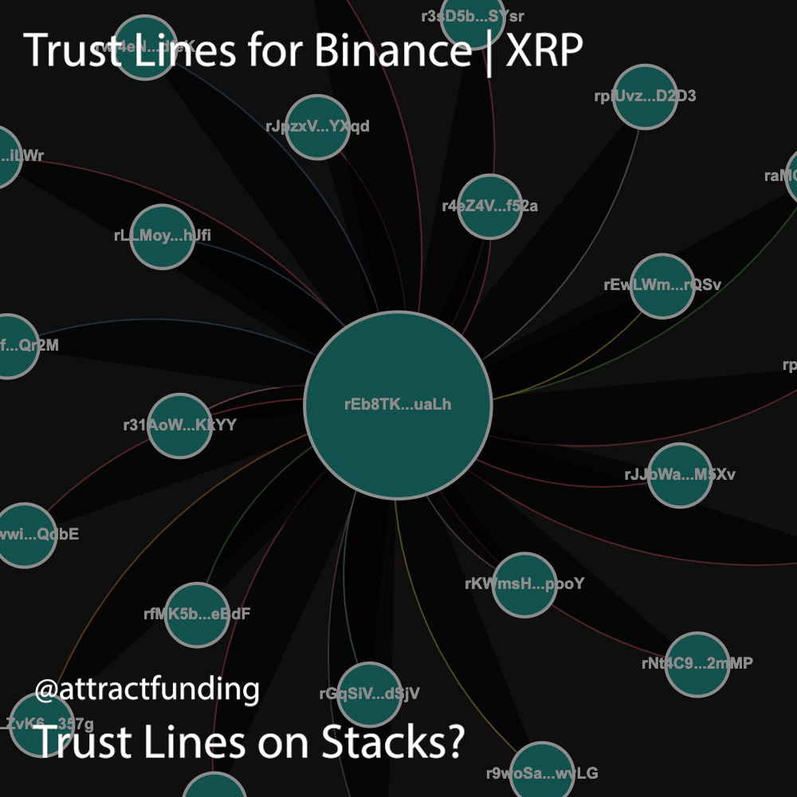
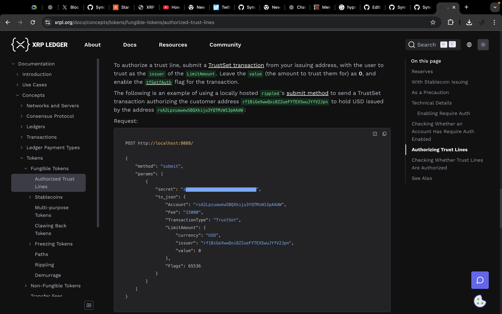

# KEEP SHIT OUTCHA WALLET
## Trust Lines on Stacks | XRP Spec
### By introducing Trust Lines on Stacks | XRP spec, stacks price go up by enabling trusted microcosms on-chain, allowing for exchanges, AMMs, order books and more to be created in seconds just like on XRP.

## EXECUTIVE SUMMARY

This SIP proposes the introduction of Trust Lines to the Stacks blockchain as a non-consensus breaking mechanism to facilitate flexible and trust-based token management within the Stacks ecosystem.

##### SIP TYPE: Non-Consensus Breaking Change

##### SIP Number: (To be assigned by SIP Editor)

##### Title: Introducing Trust Lines to the Stacks Blockchain

##### Author: Michael Jagdeo | NotebookLM | Stacks Community | @attractfund1ng

##### Consideration: Technical

##### Type: Standard

##### Status: Draft

##### Created: 2023-11-08

##### License: BSD-2-Clause

##### Discussions-To: (Link to a relevant forum or mailing list)

## GET TO THE TECHNICAL POINT ALREADY

This SIP outlines a new Clarity library and corresponding functions for implementing Trust Lines on the Stacks blockchain. The Trust Lines mechanism would operate as a layer on top of existing token standards and would not require any consensus-breaking changes to the Stacks blockchain.

The proposed Trust Lines system will include the following features:
- **Trust Line Establishment**: Users can establish a Trust Line for a specific token with another user by specifying the token, the counterparty, and the credit limit.
- **Token Transfers via Trust Lines**: Transfers of tokens between accounts with established Trust Lines can occur without requiring immediate on-chain settlements. The system will maintain a balance ledger for each Trust Line, tracking credits and debits.
- **Trust Line Modification**: Users can modify the credit limit of an existing Trust Line, either increasing or decreasing it.
- **Trust Line Closure**: Users can close a Trust Line, settling any outstanding balances using on-chain token transfers.

The Clarity library will provide the following functions:
- **establish-trust-line**: Creates a new Trust Line between two accounts.
- **transfer-via-trust-line**: Executes a token transfer through an existing Trust Line.
- **modify-trust-line**: Changes the credit limit of a Trust Line.
- **close-trust-line**: Settles outstanding balances and closes a Trust Line.

## FEATURES ATTRIBUTES AND BENEFITS FOR STACKS BY INTRODUCING TRUST LINES

- Increased Flexibility: Trust Lines provide a more granular and customizable approach to managing token relationships between users.
- Reduced On-Chain Transactions: Transactions within Trust Lines can occur off-chain, reducing the load on the Stacks blockchain and potentially lowering transaction fees.
- Enhanced Privacy: Transactions within established Trust Lines can remain private between the counterparties.

## BACKWARDS COMPATIBILITY

The introduction of Trust Lines as outlined in this SIP will be implemented as a Clarity library, operating on top of existing token standards and functionalities. Therefore, it will be fully backward compatible and will not require any changes to existing Stacks contracts or functionalities.

## ACTIVATION

This SIP will be considered activated when the following criteria are met:

- The proposed Clarity library for Trust Lines is developed and publicly available.
- At least three dApps or applications on the Stacks blockchain have integrated and actively utilize the Trust Line functionality.
- Documentation and tutorials for using the Trust Lines library are readily available for developers.

See full XRP Trust Line Spec here:
https://xrpl.org/docs/concepts/tokens/fungible-tokens/authorized-trust-lines
